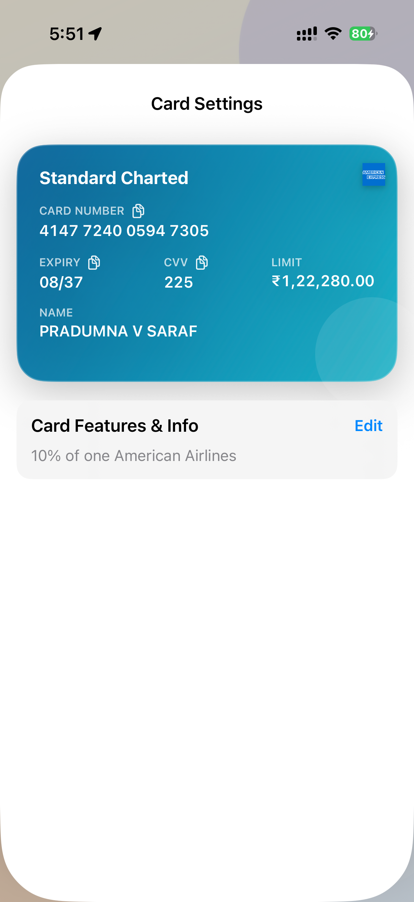
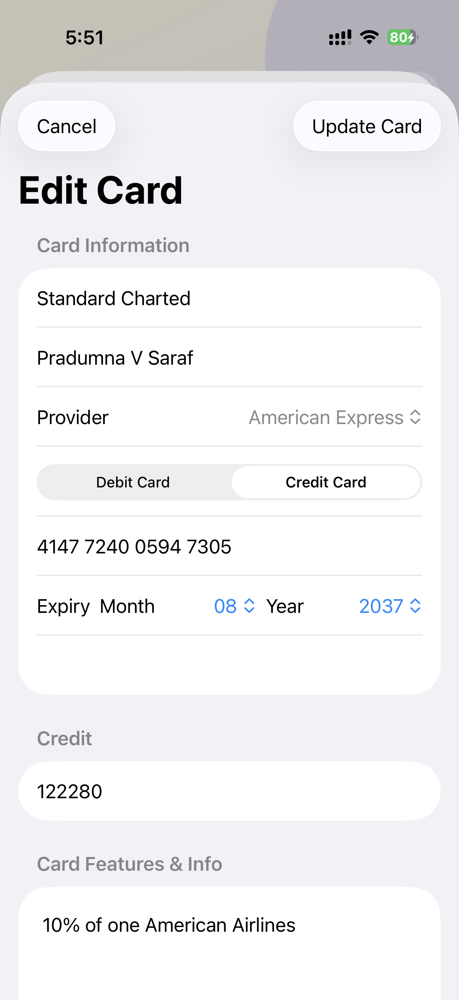

  

# CardVault

CardVault is a clean, secure iOS card wallet built for local-first privacy. Your card data stays on your iPhone and is never uploaded to a backend or cloud service.

  
  &nbsp;
  
  &nbsp;
  
  &nbsp;
  

## Why CardVault

- Local-first: no backend, no cloud sync
- Face ID protected for sensitive actions
- Fast access with a modern card UI
- Card provider logos, notes, and cardholder name support
- Copy card number, expiry, and CVV with one tap

## Privacy & Security

- Sensitive values (`cardNumber`, `cvv`) are stored in iOS Keychain.
- Metadata is encrypted at rest using `CryptoKit` (`AES.GCM`).
- All data stays on-device and local to your iPhone.
- CardVault does not require an account and does not send card data to external servers.

## Getting Started

1. Open `CardVault.xcodeproj` in Xcode.
2. Set your signing team in `Signing & Capabilities`.
3. Connect your iPhone and choose it as the run destination.
4. Build and run.

## License

Licensed under Apache-2.0. See [LICENSE](LICENSE).
